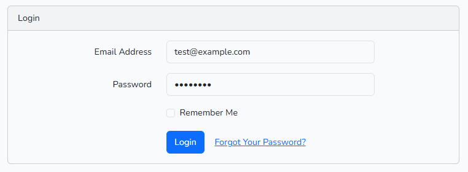
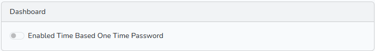
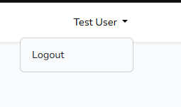
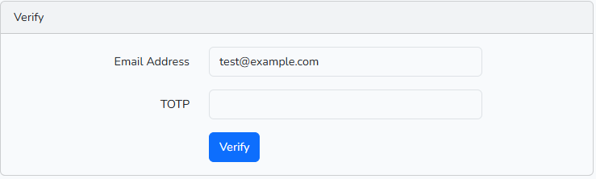

<h1 style="text-align: center">Laravel TOTP</h1>

Laravel Time Based One Time Based

## Prerequisites

- [Laravel 11](https://laravel.com/docs/11.x)
- [php 8.2](https://www.php.net/)
- [sqlite](https://sqlite.org/)
- [Composer](https://getcomposer.org/)
- [Google Authenticator](https://play.google.com/store/apps/details?id=com.google.android.apps.authenticator2&hl=en)
OR<br> [Microsoft Authenticator](https://apps.microsoft.com/app/authenticator)

## How to Run

Clone the repository and run the following command:

```bash
git clone https://github.com/codersandip/laravel-totp.git
cd laravel-totp
composer install
cp .env.config .env
php artisan key:generate
php artisan migrate --seed
php artisan serve
```

## How to Use


1. Open URL `http://localhost:8000`
2. Click on [Login](http://localhost:8000/login)
3. Enter Username and Password
4. Click on [Login](http://localhost:8000/login)
    
5. Click on [Enable TOTP](http://localhost:8000/home)
    
6. Display QR Code
    
7. Open [Google Authenticator](https://play.google.com/store/apps/details?id=com.google.android.apps.authenticator2&hl=en) or [Microsoft Authenticator](https://apps.microsoft.com/app/authenticator)
8. Scan the QR code
9. Logut the Laravel TOTP Application
    
10. Login the Laravel TOTP Application

9. Enter the code generated by the application
    
10. Click on [Verify](#)


<!-- 1. 
2. Scan the QR code
3. Enter the code generated by the application
4. Click on [Verify Code](https://play.google.com/store/apps/details?id=com.google.android.apps.authenticator2&hl=en) -->